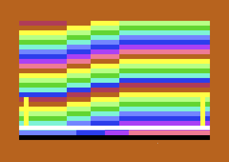
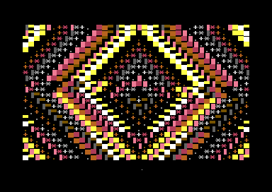
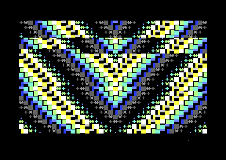

# C64 Mega Demo

[](https://github.com/djayuffe/C64-Mega-Demo/actions/workflows/ci.yml)

A continuous 28-part Commodore 64 audiovisual demo built in ACME assembly.
It combines a raster-timed visual engine with a three-SID techno score: bass
at `$d400`, melodic voices at `$d420`, and drums at `$d440`.

The historic source filename is `src/subway.s`; the shipped program is the
multi-effect C64 Mega Demo, not a separate subway application.

## Features

- 28 linked scenes: pulse fields, plasma, hyperspace, waves, tunnels,
  wireframes, hearts, grids, orbital fields, corridors, and rotating cubes.
- Three independently addressed SID chips driven by one IRQ-timed score.
- Music-bar-based scene timing, deterministic transitions, and beat-responsive
  colour polish.
- A connected Cube V3 finale and repaired Wire Cube, Infinity Corridor, and
  Gold Trench VIC state handling.
- Reproducible build, source audit, checksum verification, and GitHub Actions.

## Runtime gallery

The images below are direct captures of the locally built PRG running in VICE
with the intended three-SID address map. They are runtime frames, not mockups.

| Representative sequence | Capture |
| --- | --- |
| Rainbow tunnel |  |
| Prismatic field |  |
| Geometric wireframe |  |

## Build and run

Requirements: [ACME](https://sourceforge.net/projects/acme-crossass/) and
[VICE](https://vice-emu.sourceforge.io/) (or compatible C64 hardware/emulator).

```sh
make
x64sc -sidextra 2 -sid2address 0xd420 -sid3address 0xd440 \
  -autostartprgmode 1 -autostart build/c64-mega-demo-3sid.prg
```

`./build_release.sh` is a wrapper for `make`. The program will display with
one SID, but the intended score needs the three-chip map above.

To rebuild and validate the complete release manifest:

```sh
make verify
```

## Design notes

The program starts from a BASIC `SYS 2061` loader, installs a single stable
raster IRQ, and measures scene duration in musical bars. `InitTbl` and
`UpdateTbl` each have 28 entries and are the authoritative lifecycle dispatch.
The current release is intentionally continuous: title-card and scroller
routines are dormant rather than visible runtime features.

See [docs/DEVELOPMENT.md](docs/DEVELOPMENT.md) for the source map and 3SID
setup, and [docs/AUDIT.md](docs/AUDIT.md) for the release checks.

The complete 28-scene screenshot gallery and effect descriptions are in
[docs/EFFECTS.md](docs/EFFECTS.md).

## License

Copyright © 2026 Ulf Bertilsson. Licensed under
[GPL-3.0-or-later](LICENSE); see [NOTICE](NOTICE).
