# Complete effect gallery

Every row below is one entry in the production `InitTbl`/`UpdateTbl` dispatch.
The image is a native 384×272 VICE capture of that renderer running in the
three-SID build. The first 15 captures were produced with the deterministic
`START_PART` review selector; the remaining frames were captured from the same
PRG at their corresponding sequence windows. They are visual evidence of the
shipped renderers, not concept art.

| # | Effect | Description | Runtime screenshot |
|---:|---|---|---|
| 0 | 3SID Pulse Field | Opening colour field driven by the shared bass, melody, and drum pulse envelopes. | 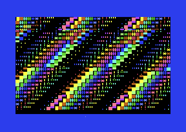 |
| 1 | Plasma Storm | Interfering phase tables write a continuously changing plasma colour surface. |  |
| 2 | Hyperspace | Centre-out fixed-point star motion accelerates toward the viewer. |  |
| 3 | XOR Moire | Sharp XOR interference bands form high-contrast rotating diamond patterns. |  |
| 4 | Waves | Sine-displaced horizontal colour bands sweep across the text-mode field. | 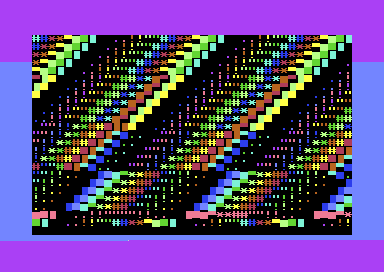 |
| 5 | Tunnel | A forward-moving colour tunnel uses depth and yaw phases without self-modifying code. |  |
| 6 | Sine Starfield | Fast and slow star populations drift in parallax while their colours pulse. |  |
| 7 | Text Wireframe | A row-safe text-mode wireframe grid adapts cube geometry to the character screen. | 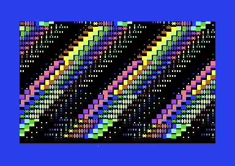 |
| 8 | Heart Voyager Trail | A heart silhouette receives a moving voyager trail and halo treatment. | 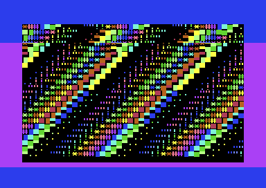 |
| 9 | Multiplex Cube | Alternating horizontal and vertical edge bars evoke sprite-multiplex timing in text mode. | 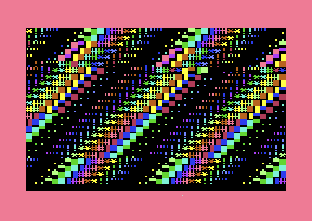 |
| 10 | Yaw Wobble Tunnel | A tunnel variant applies deterministic column wobble and per-cell tint. | 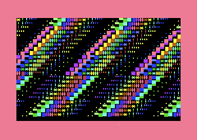 |
| 11 | Turbo Boot Tunnel | A high-energy boot-grid tunnel uses automatic text-mode zoom phases. | 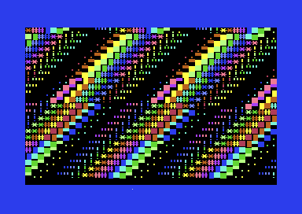 |
| 12 | Golden Halo Heart | A distinct golden animated halo surrounds the heart form. |  |
| 13 | Raster Grid Boot | Layered grid rows and raster colour changes create a boot-up field. | 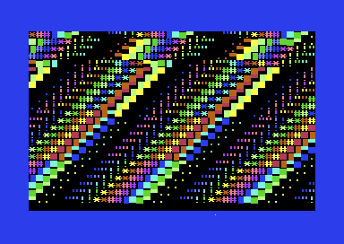 |
| 14 | Cyber Grid | A neon matrix-floor adaptation combines grid geometry with music colour response. | 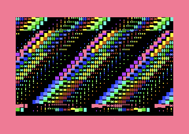 |
| 15 | Safe Tunnel Prime | A conservative tunnel renderer with bounded arithmetic and stable row ownership. | 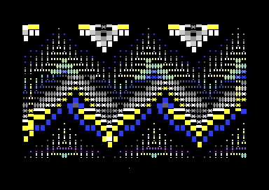 |
| 16 | Black Orbit Field | Orbital rings fold around a dark centre to create a black-hole impression. | 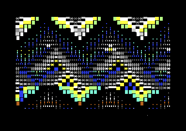 |
| 17 | Rotor Cube Final | A corrected 16-step rotating cube uses projected front/back rectangles and sparse connectors. | 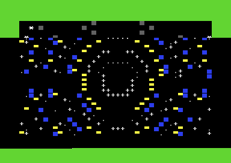 |
| 18 | Solar Flare | A radial flare renderer expands bright colour energy from a central origin. | 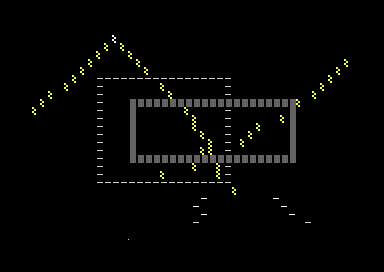 |
| 19 | Prism Gate | Layered gate bars open and close around a colour-shifting central passage. | 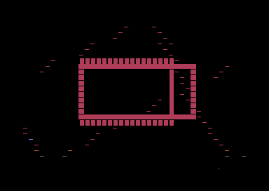 |
| 20 | Twist Lattice | Interleaved lattice lines twist through phase-shifted character and colour tables. | 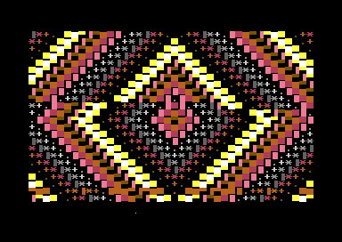 |
| 21 | Infinity Corridor | Distance tables, column warp, and palette cycling form an endless corridor. | 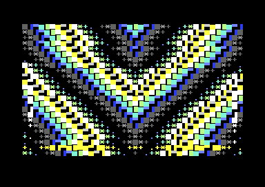 |
| 22 | Gold Trench | Perspective rails, inner glow, vanishing markers, and beat crossbars draw a gold trench. | 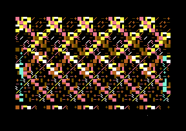 |
| 23 | Cube V3 Rotor | A stable 3D wire cube draws front/rear planes, corner joints, and independent depth connectors. | 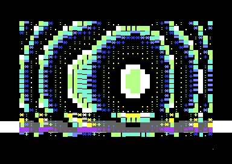 |
| 24 | Vortex | Precomputed angle/distance fields rotate a dense colour vortex around the screen. | 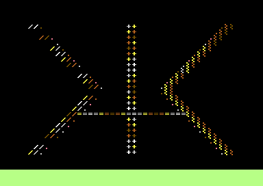 |
| 25 | Mux Edge Field | Alternating edge bands convert sprite-multiplex timing ideas into safe character geometry. | 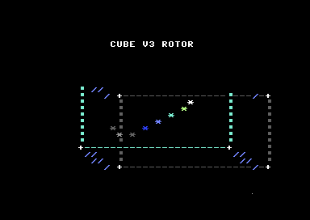 |
| 26 | Raster Boot Tunnel | A raster-synchronised boot tunnel builds depth with bounded row and phase tables. | 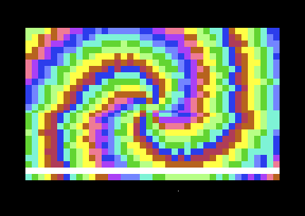 |
| 27 | Wire Cube Clean | Mirrored moving wire accents close the sequence with a sparse cube-grid motif. | 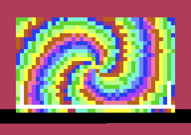 |

## Reproduction

The selector is an assembler-time review aid and does not change the normal
release start (part 0):

```sh
cd src
acme -DSTART_PART=23 -f cbm -o ../build/review-effect-23.prg subway.s
x64sc -sidextra 2 -sid2address 0xd420 -sid3address 0xd440 \
  -autostartprgmode 1 -autostart ../build/review-effect-23.prg
```
